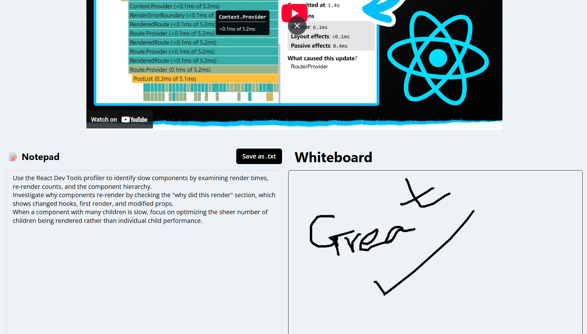
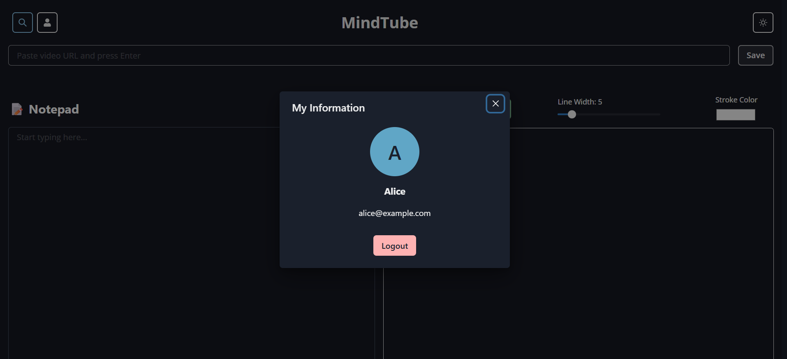
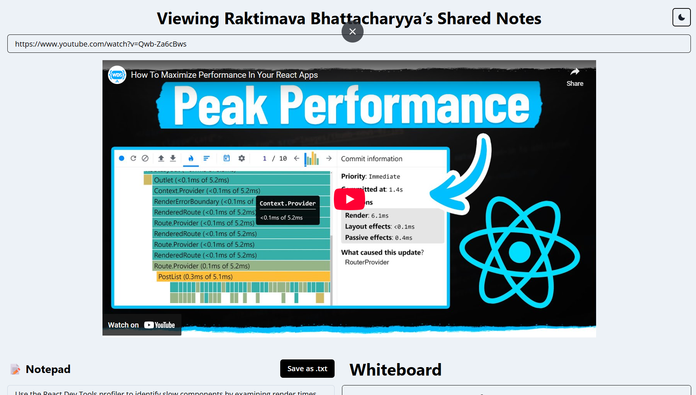

# MindTube 🎓🧠

**MindTube** is a full-stack collaborative learning platform that lets
users take notes, draw on a whiteboard, and store content tied to
specific video URLs --- all in one place. It features secure Google
OAuth login, real-time tools, and role-based access control.

> 🚀 Deployed at: <https://mindtube.onrender.com>

------------------------------------------------------------------------

## 🛠️ Tech Stack

### Frontend (`client/`)

-   ReactJS with Vite
-   Chakra UI & Emotion
-   React Router DOM
-   Google OAuth (`@react-oauth/google`)
-   Axios for API handling

### Backend (`server/`)

-   Node.js & Express
-   MongoDB with Mongoose
-   JWT-based authentication
-   bcryptjs, dotenv, cors
-   Express async handler

------------------------------------------------------------------------

## 🔐 Features

-   🔑 Google OAuth login & JWT session management
-   📝 Notepad and 🧾 whiteboard tools per video
-   🔒 Role-based access: only owners can edit their content
-   📦 Deployed as a single web service on [Render](https://render.com)
-   🌐 Fully responsive Chakra UI design with theme switching

------------------------------------------------------------------------

## 🚀 Getting Started

### Clone the repo
```bash
git clone https://github.com/raktimava29/Canvas.git
cd server
npm install
npm start
cd client
npm install
npm run dev
 
## ENV FIle
MONGO_URI=your_mongodb_connection_string
JWT_SECRET=your_jwt_secret
GOOGLE_CLIENT_ID=your_google_oauth_client_id
NODE_ENV=production
 ```
------------------------------------------------------------------------

## 📸 Screenshots

### 🧑‍🏫 Profile 



### 📝 Editable Content



### 🧾View Only


