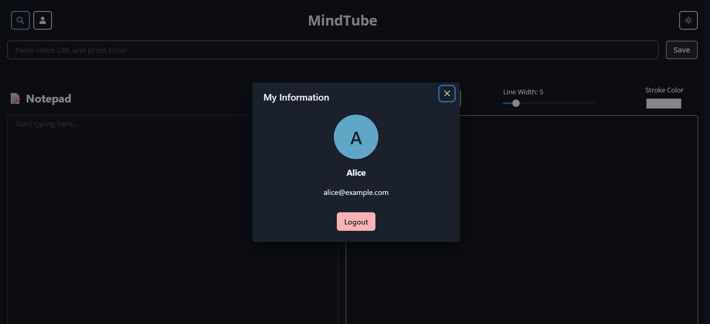
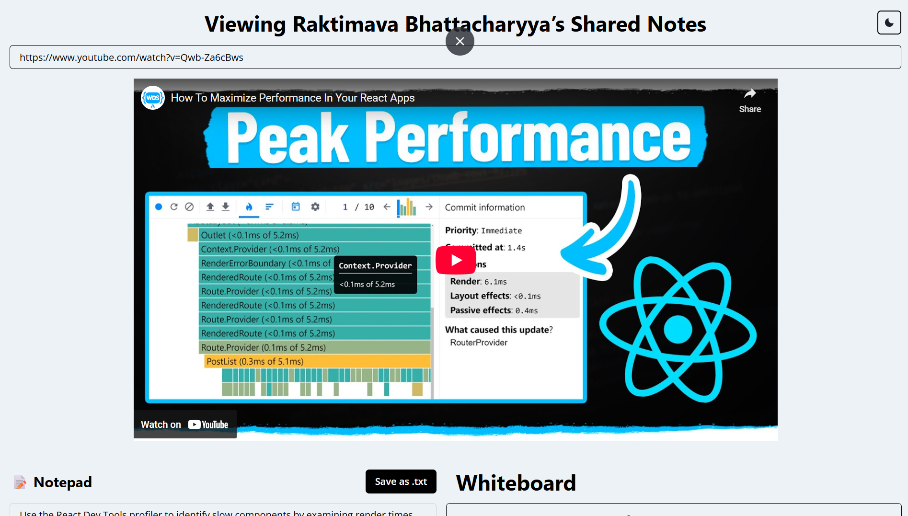
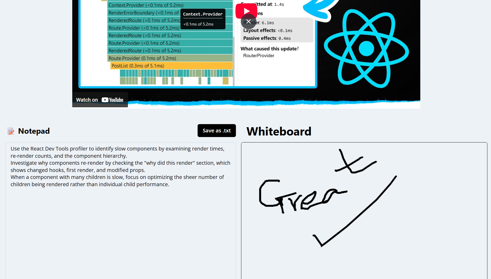

# MindTube 🎓🧠

**MindTube** is a full-stack collaborative learning platform that pairs a notepad and whiteboard directly with any YouTube video or hosted video URL — so your notes and sketches live alongside the content that inspired them.

> 🚀 **Live demo:** [mindtube-pied.vercel.app](https://mindtube-pied.vercel.app/)

---

## ✨ Features

- 🔑 **Secure auth** — Email/password and Google OAuth login
- 📺 **Video support** — YouTube (standard, shorts, youtu.be), MP4, WebM, OGG
- 📝 **Notepad** — Rich text notes saved per video URL
- 🎨 **Whiteboard** — Freehand canvas with color picker, brush size, undo/redo, and export
- 🔒 **Role-based access** — Only the owner of a video session can edit; others view read-only
- 🌗 **Dark / light mode** — Full Chakra UI theme switching
- 📱 **Responsive layout** — Works on desktop and tablet

---

## 🛠️ Tech Stack

### Frontend (`client/`)

| Tool | Purpose |
|---|---|
| React 19 + Vite | UI framework & build tool |
| Chakra UI v2 | Component library & theming |
| Tailwind CSS | Utility classes for layout |
| React Router DOM v7 | Client-side routing |
| `@react-oauth/google` | Google OAuth 2.0 |
| Axios | HTTP client with JWT interceptors |
| Framer Motion | Animations |

### Backend (`server/`)

| Tool | Purpose |
|---|---|
| Python 3.12+ | Language |
| FastAPI | REST API framework |
| Uvicorn | ASGI server |
| MongoDB + PyMongo | Database |
| PyJWT | JWT token signing & verification |
| Passlib + bcrypt | Password hashing |
| Pydantic v2 | Request/response validation |
| `uv` | Fast Python package manager |

---

## 📁 Project Structure

```
Canvas/
├── client/                  # React + Vite frontend
│   └── src/
│       ├── api/             # Axios instance + interceptors
│       ├── assets/          # Images and icons
│       └── components/
│           ├── Home/        # Home, Login, Signup pages
│           ├── Misc/        # SideDrawer, SearchUser, Profile, ColorToggle
│           ├── Notepad/     # Notepad component
│           └── Whiteboard/  # Canvas whiteboard + tools
└── server/                  # FastAPI backend
    └── app/
        ├── controllers/     # Business logic
        ├── core/            # Config, DB, security, dependencies
        ├── middleware/      # Error handlers
        ├── routers/         # Route definitions
        └── schemas/         # Pydantic models
```

---

## 🚀 Getting Started

### Prerequisites

- Node.js 18+
- Python 3.12+
- MongoDB (local or Atlas)
- A Google OAuth Client ID ([create one here](https://console.cloud.google.com/))

---

### 1. Clone the repo

```bash
git clone https://github.com/raktimava29/Canvas.git
cd Canvas
```

---

### 2. Backend setup

```bash
cd server

# Install uv if you don't have it
pip install uv

# Install dependencies
uv sync

# Copy and fill in your environment variables
cp .env.example .env
```

Edit `.env`:

```env
MONGO_URI=your_mongodb_connection_string
JWT_SECRET=your_jwt_secret_key
```

Start the server:

```bash
uv run uvicorn app.main:app --reload
```

The API will be available at `http://localhost:8000`.

---

### 3. Frontend setup

```bash
cd client

npm install

# Copy and fill in your environment variables
cp .env.example .env
```

Edit `.env`:

```env
VITE_API_URL=http://localhost:8000
VITE_GOOGLE_CLIENT_ID=your_google_oauth_client_id
```

Start the dev server:

```bash
npm run dev
```

The app will be available at `http://localhost:5173`.

---

## 🔌 API Endpoints

### Auth (`/api/user`)

| Method | Endpoint | Auth | Description |
|---|---|---|---|
| POST | `/api/user` | ❌ | Register with email & password |
| POST | `/api/user/login` | ❌ | Login with email & password |
| POST | `/api/user/google-signup` | ❌ | Register via Google OAuth |
| POST | `/api/user/google-login` | ❌ | Login via Google OAuth |
| GET | `/api/user` | ✅ | Search users by name |
| GET | `/api/user/{user_id}` | ✅ | Get user by ID |

### Content (`/api/content`)

| Method | Endpoint | Auth | Description |
|---|---|---|---|
| POST | `/api/content/save` | ✅ | Save or update notepad + whiteboard |
| GET | `/api/content` | ✅ | Fetch content by video URL |

---

## 🖥️ Screenshots

### Profile


### Editable Session


### Read-Only View



---

© 2026 MindTube. All rights reserved.